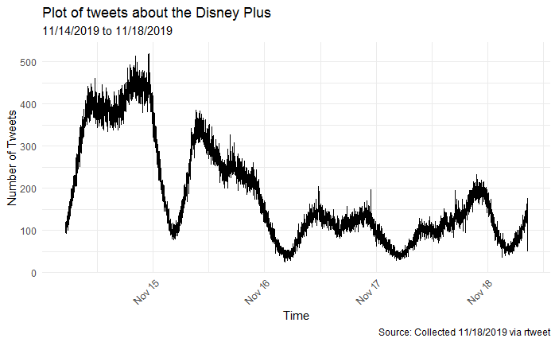
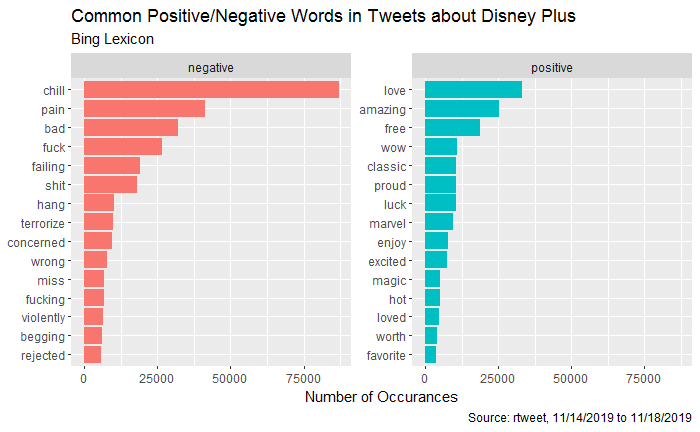
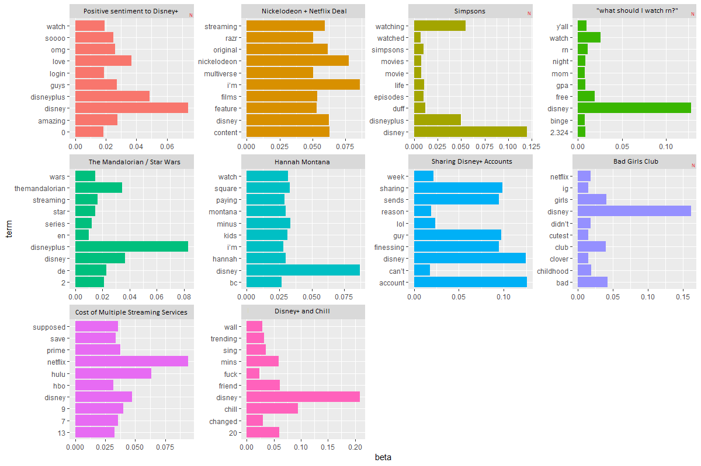

disney\_tweets
================
Josephine Lukito
November 21, 2019

# Setup

``` r
disneytweets <- read.csv("rtweet_disneyplus_slim.csv", header = TRUE, stringsAsFactors = FALSE)

disneytweets$created_at <- disneytweets$created_at %>% as.POSIXct(tz = "UTC")
disneytweets$time2 <- disneytweets$created_at-6*60*60

disneytweets <- disneytweets[order(as.POSIXct(disneytweets$time2)),]
disneytweets$int <- seq.int(1, nrow(disneytweets))
```

The corpus includes some tweets that just talked about Disney (and not
Disney plus specifically), so I’m going to focus only on the tweets that
mention “Disney plus” or “disney+” (with or without the spaces).

``` r
disneykey <- c("Disney plus", "disneyplus", "disney\\+", "disney  \\+")
disneytweets$disneyplus <- grepl(paste(disneykey, collapse = "|"), disneytweets$text, ignore.case = TRUE)
disneyplus <- subset(disneytweets, disneyplus == TRUE) #subset this data
```

How many tweets about Disney Plus also included mentions of the
Mandalorian or Baby Yoda?

``` r
disneyplus$mando <- grepl(c("mandalorian", "themandalorian", "baby yoda", "babyyoda"), disneyplus$text, ignore.case = TRUE)
```

``` r
sum(disneyplus$mando)
```

    ## [1] 39430

Let’s clean up our data, since we have some web-code in
there.

``` r
cleanFun <- function(htmlString) {return(gsub("<.*?>", "", htmlString))} 
  #retrieved from here https://stackoverflow.com/questions/17227294/removing-html-tags-from-a-string-in-r
disneyplus$text2 <- sapply(disneyplus$text, cleanFun) 
disneyplus$text2 <- gsub(" ?(f|ht)tp(s?)://(.*)[.][a-z]+/[[:alnum:]]+", "", disneyplus$text2) #t.co links
disneyplus$text2 <- gsub("\\&amp\\;", "\\&", disneyplus$text2) #ampersands
```

# Timeline

When are people tweeting about Disney plus?

``` r
disneycount <- table(disneyplus$time2) %>% as.data.frame()
disneycount$Var1 <- as.POSIXct(disneycount$Var1)
disneymin <-aggregate(list(Freq=disneycount$Freq),by=list(time=cut(disneycount$Var1,"min")),sum)
disneymin$time <- disneymin$time %>% as.POSIXct()
disneymin <- disneymin[9:5982,] #the first 8 rows have very few tweets, owing to the collection time

plotting <- ggplot(disneymin, aes(time)) + 
  geom_line(aes(y = Freq)) + #black
    labs(title="Plot of tweets about the Disney Plus",
       subtitle = "11/14/2019 to 11/18/2019", 
       x="Time", y = "Number of Tweets",
       caption = "Source: Collected 11/18/2019 via rtweet") +
  theme_minimal() +
  theme(axis.text.x = element_text(angle = 45, hjust = 1)) 

plot(plotting)
```

<!-- -->

# Sentiment 
Let’s do a quick sentiment analysis using tidytext and the `bing` lexicon

``` r
disney_unnest <- disneyplus %>% 
  unnest_tokens(word, text2) %>%
  count(X, word, sort = TRUE) %>%
  anti_join(stop_words) 
```

    ## Joining, by = "word"

``` r
disney_wordct <- disney_unnest %>% count(word, sort = TRUE) %>% as.data.frame()
disney_wordct[1:50,]
```

    ##           word      n
    ## 1       disney 944814
    ## 2   disneyplus 186530
    ## 3      netflix 118073
    ## 4        watch  96565
    ## 5     watching  95964
    ## 6    streaming  95702
    ## 7          i’m  92385
    ## 8         hulu  88925
    ## 9      account  88569
    ## 10       chill  86975
    ## 11 nickelodeon  75000
    ## 12     sharing  69660
    ## 13         guy  68706
    ## 14       sends  67010
    ## 15   finessing  66973
    ## 16      friend  56695
    ## 17          20  55929
    ## 18        mins  54805
    ## 19     content  51064
    ## 20    original  50392
    ## 21       prime  44850
    ## 22           7  44408
    ## 23       films  43643
    ## 24     feature  43637
    ## 25    supposed  42554
    ## 26  multiverse  41494
    ## 27        razr  41364
    ## 28        pain  41355
    ## 29    creating  41309
    ## 30    comeback  41198
    ## 31      sprung  41156
    ## 32     remixed  41153
    ## 33        save  40181
    ## 34           9  39653
    ## 35          13  38933
    ## 36         hbo  37691
    ## 37           6  37294
    ## 38       month  37159
    ## 39        love  33133
    ## 40          12  32833
    ## 41       movie  32686
    ## 42        it’s  32286
    ## 43         bad  32166
    ## 44         max  31460
    ## 45       girls  31198
    ## 46          10  31106
    ## 47      access  30968
    ## 48        club  30605
    ## 49      amazon  30127
    ## 50         cbs  30002

``` r
disneyp_senti <- disney_unnest %>%
  inner_join(get_sentiments("bing")) %>%
  count(word, sentiment, sort = TRUE)
```

    ## Joining, by = "word"

``` r
disneyp_senti %>%
  group_by(sentiment) %>%
  top_n(15) %>%
  ungroup() %>%
  mutate(word = reorder(word, n)) %>%
  ggplot(aes(word, n, fill = sentiment)) +
  geom_col(show.legend = FALSE) +
  facet_wrap(~sentiment, scales = "free_y") +
  labs(title = "Common Positive/Negative Words in Tweets about Disney Plus",
       subtitle = "Bing Lexicon",
       y = "Number of Occurances",
       x = NULL,
       caption = "Source: rtweet, 11/14/2019 to 11/18/2019") +
  coord_flip()
```

    ## Selecting by n

<!-- -->

## Disney and Chill

``` r
disneyplus$chill <- grepl("chill", disneyplus$text, ignore.case = TRUE) #take all tweets with fiji in it
disney_chill <- subset(disneyplus, chill == TRUE) #subset this data
disney_cunique <- unique(disney_chill$text2) %>% as.data.frame()

#Some fun Disney Plus tweets with the word "chill"
disney_cunique$.[2]
```

    ## [1] Millennials have Netflix and chill \n\nGen Z has Disney+ and lick deez nuts
    ## 6172 Levels: 'Disney Plus and chill' is a euphemism that means let's complain about old TV shows being in the wrong order and aspect ratio. ...

``` r
disney_cunique$.[5]
```

    ## [1] netflix n chill? hulu n hang?? no!!! DISNEY PLUS N THRUST
    ## 6172 Levels: 'Disney Plus and chill' is a euphemism that means let's complain about old TV shows being in the wrong order and aspect ratio. ...

``` r
disney_cunique$.[11]
```

    ## [1] @disneyplus @Marvel Just #Mandalorian and chill. #IHaveSpoken
    ## 6172 Levels: 'Disney Plus and chill' is a euphemism that means let's complain about old TV shows being in the wrong order and aspect ratio. ...

``` r
disney_cunique$.[17]
```

    ## [1] I can’t people out there repeating the famous “Netflix and chill” memes with Disney+ now 
    ## 6172 Levels: 'Disney Plus and chill' is a euphemism that means let's complain about old TV shows being in the wrong order and aspect ratio. ...

``` r
disney_cunique$.[23]
```

    ## [1] forget netflix & chill, i’m tryna disney+ & bust on sum titties
    ## 6172 Levels: 'Disney Plus and chill' is a euphemism that means let's complain about old TV shows being in the wrong order and aspect ratio. ...

``` r
disney_cunique$.[26]
```

    ## [1] netflix and chill just got upgraded to disney plus and thrust
    ## 6172 Levels: 'Disney Plus and chill' is a euphemism that means let's complain about old TV shows being in the wrong order and aspect ratio. ...

``` r
disney_cunique$.[37]
```

    ## [1] Who wants to Netflix and Chill when you can #DisneyPlus and not get distracted because it’s actually solid content?
    ## 6172 Levels: 'Disney Plus and chill' is a euphemism that means let's complain about old TV shows being in the wrong order and aspect ratio. ...

``` r
disney_cunique$.[45]
```

    ## [1] No more Netflix chill. Now it’s Disney+ this dick
    ## 6172 Levels: 'Disney Plus and chill' is a euphemism that means let's complain about old TV shows being in the wrong order and aspect ratio. ...

``` r
disney_cunique$.[61]
```

    ## [1] Fuck Netflix & chill, it’s Disney plus till I BUST
    ## 6172 Levels: 'Disney Plus and chill' is a euphemism that means let's complain about old TV shows being in the wrong order and aspect ratio. ...

``` r
disney_cunique$.[68]
```

    ## [1] We’ve gone from Netflix and chill to Disney+ this dick.
    ## 6172 Levels: 'Disney Plus and chill' is a euphemism that means let's complain about old TV shows being in the wrong order and aspect ratio. ...

``` r
disney_cunique$.[78]
```

    ## [1] I’m just tryna Disney+ and chill with someone’s daughter
    ## 6172 Levels: 'Disney Plus and chill' is a euphemism that means let's complain about old TV shows being in the wrong order and aspect ratio. ...

``` r
disney_cunique$.[91]
```

    ## [1] Netflix and chill is over. Time for Disney plus get in them guts
    ## 6172 Levels: 'Disney Plus and chill' is a euphemism that means let's complain about old TV shows being in the wrong order and aspect ratio. ...

``` r
disney_cunique$.[192]
```

    ## [1] Disney plus and lust? Or Netflix and chill?
    ## 6172 Levels: 'Disney Plus and chill' is a euphemism that means let's complain about old TV shows being in the wrong order and aspect ratio. ...

# Topic Modeling

``` r
library(topicmodels)
disney_dtm <- disney_unnest %>% cast_dtm(X, word, n)

disney_lda <- LDA(disney_dtm, k = 10, control = list(seed = 100))

disney_topics <- tidy(disney_lda, matrix = "beta")
#disney_topics

disney_topterms <- disney_topics %>%
  group_by(topic) %>%
  top_n(10, beta) %>%
  ungroup() %>%
  arrange(topic, -beta)

disney_topterms %>%
  ggplot(aes(term, beta, fill = factor(topic))) +
  geom_col(show.legend = FALSE) +
  facet_wrap(~ topic, scales = "free") +
  coord_flip()
```
<!-- -->
